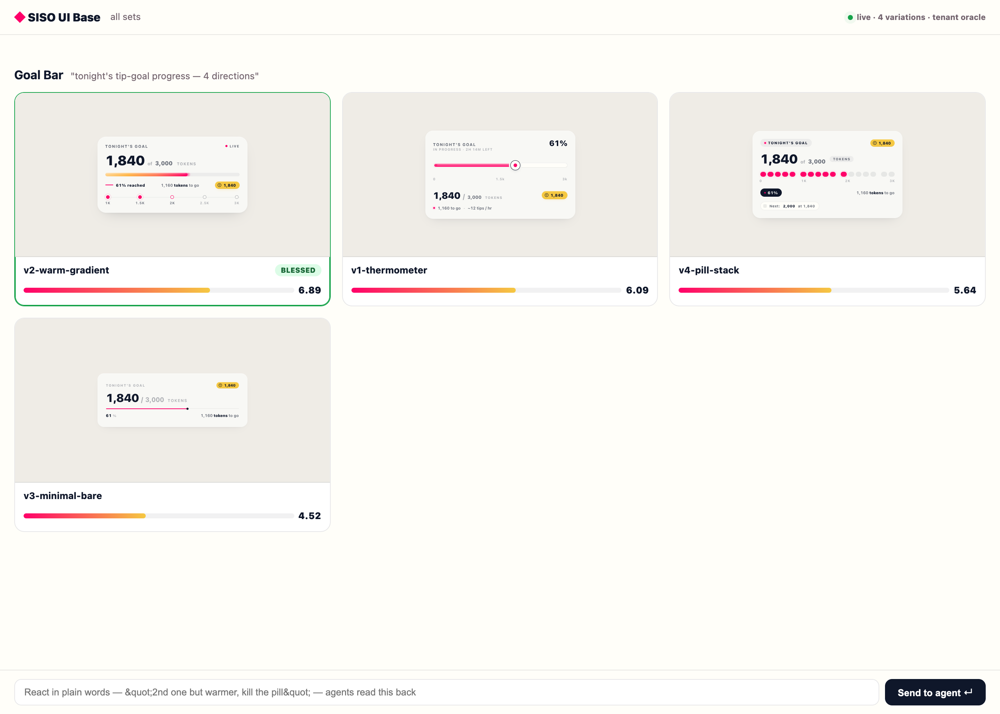

# SISO UI Base

**Build UI with an agent fleet + a human in the loop.** Agents forge self-contained HTML variations → you review them live in the **UI Box** and react in plain words → agents iterate → winners graduate to production React. Agent-neutral (Claude *or* Codex). Zero build step.

> The human stays on **taste**. The agent does **production**. HTML is the agent's clay (fast, isolated, no build); React is where blessed designs land.



---

## Health check

```bash
node doctor.mjs     # every layer, what is missing, how to fix it
```

The core is zero-dependency (Node built-ins only). **Playwright is optional** and
needed solely by `pipeline/shoot.mjs` for the visual judge — `npm install` when
you want scoring.

## One command

```bash
node brief.mjs "pricing section"
```

Joins every layer — tenant DNA, real components with previews, the design
principles that apply, and the DNA self-audit — into a single brief. Agents run
this instead of learning four separate tools.

## 60-second start

```bash
# 1. run the UI Box (zero deps — Node built-ins only)
UIBASE_TENANT=tenants/oracle node app/serve.mjs
# → http://127.0.0.1:8810/

# 2. an agent forges variations into the tenant folder:
#    tenants/oracle/variations/<set>/v1-name.html  (self-contained HTML)
#    the grid auto-refreshes as files land.

# 3. score them so the grid ranks before you look:
node pipeline/shoot.mjs && node pipeline/judge.mjs v1-name v2-name ...

# 4. you react in the UI Box ("2nd one but warmer, kill the pill") or bless one.
#    feedback → tenants/oracle/feedback-latest.json   (agent reads → iterates)
#    bless    → tenants/oracle/winner.json            (agent reads → graduates)
```

## The loop

```
you: "build me 4 variations of the goal bar"
  → agent writes 4 standalone .html into variations/goal-bar/
  → each auto-scored 0-10 against the tenant DNA (slop never reaches you)
  → UI Box shows them ranked, TOP/BLESSED badges, live iframes
  → you react in plain words, or bless one
  → agent iterates (v1→v2, shown side-by-side with score deltas)
  → blessed HTML = source of truth → agent ports to React pixel-for-pixel, screenshot-diff verified
```

## What's in here

| Path | What |
|---|---|
| `app/serve.mjs` | The UI Box server — zero-dep, filesystem-as-state (manifest + SSE + review/bless writes) |
| `app/index.html` | The viewer — React-via-CDN, scaled-iframe grid / deep-look / compare / bless, safe srcdoc render |
| `pipeline/` | The **visual judge** — Playwright shoots → Codex-vision scores vs `rubric.mjs` (built from the DNA). Proven: Oracle chat-rail anchor = 9.24 |
| `batteries/gates/dna-grep.mjs` | Deterministic source-rule gate (Stage 1) |
| `tenants/oracle/` | Tenant zero: `dna.md` (the design rules) + `variations/` + generated state |
| `commands/` | Sub-command playbooks: forge-variations · show-me · score-panel · iterate · graduate · calibrate · add-library |
| `registry/repos.json` | 33-repo prior-art catalog (6 families) · `./clone.sh` to vendor for study |
| `CANONICAL.html` | **The full spec** — what it is, the home, harvest manifest, viewer architecture |
| `SKILL.md` | The drop-in agent package definition |

## Adopt in a new project

Point `UIBASE_TENANT` at that project's tenant dir (e.g. `<project>/.uihub`), drop in a `dna.md` (the design rules / rubric source), done. Oracle Streaming is the worked example. The engine is generic; the taste DNA is per-project.

## Why it's built to last

Thin stable **core** (the loop, the viewer, the contracts, filesystem-as-state) + hot-swappable **batteries** (judge model, libraries, frameworks, gates). Future drops — cheaper vision models, MCP registries, your own fine-tune — snap into named seams without a rewrite. The **moat**: every graduation emits a labeled `(html, score, blessed)` triple → a proprietary per-domain taste corpus nobody can clone; the calibration anchor makes taste verifiable and drift-detectable.

Full detail: open `CANONICAL.html`. Walkthrough: open `docs/WALKTHROUGH.html`.

## registry/principles — the reasoning layer

334 sections of universal design principles from
[`bergside/typeui`](https://github.com/bergside/typeui) (MIT) — the *why* behind
the rules, with formulas and a mandatory application order. Authored, unlike the
template-generated style skills.

```bash
node registry/principles/ingest.mjs              # refresh from GitHub
node registry/principles/ask.mjs "nested radius" # query one section
```

## registry/skills — palette & type reference

67 design skills from [`bergside/awesome-design-skills`](https://github.com/bergside/awesome-design-skills)
(MIT), each with a rendered preview. The prose is template-generated boilerplate;
the **49 distinct palettes and 38 font pairings** are the real value.

```bash
node registry/skills/ingest.mjs                     # refresh from GitHub
node registry/skills/palette.mjs --near '#ff0069'   # nearest palettes to a hex
```

Note typeui.sh itself sits behind a Vercel JS challenge and is not scrapable —
but the skills are open source, so we take them from the repo instead.

## opendesign/ — interop with OpenDesign

[OpenDesign](https://github.com/nexu-io/open-design) is a local-first desktop app
that drives your existing coding agents as a design engine. Its 143 bundled
design systems are **prose only** — a `DESIGN.md` and a manifest, no components.
That is the exact complement of this repo, which has components and previews but
keeps its taste rules per-tenant.

`opendesign/sync.mjs` keeps the two as one asset:

```bash
node opendesign/sync.mjs status              # tenants vs exported packages
node opendesign/sync.mjs export oracle       # tenant dna.md -> design-system pkg
node opendesign/sync.mjs import <pkg-dir>    # a design system -> a new tenant
```

The hub owns the source. A tenant's `dna.md` IS the design system — export copies
it verbatim, so edit the tenant, never the generated `DESIGN.md`. Set the
marketplace identity from the tenant with an optional front-matter comment:

```html
<!-- opendesign: title="SISO Oracle" description="One good sentence." -->
```

`opendesign/plugins/siso-ui-base/` packages the component corpus itself as an
OpenDesign skill, so an agent there can query all 7,949 components.

## registry/21st — component catalog

A cached, browsable board of 587 21st.dev components for design reference across
projects. `node registry/21st/serve.mjs` → http://127.0.0.1:8811/.
See [registry/21st/README.md](registry/21st/README.md).
